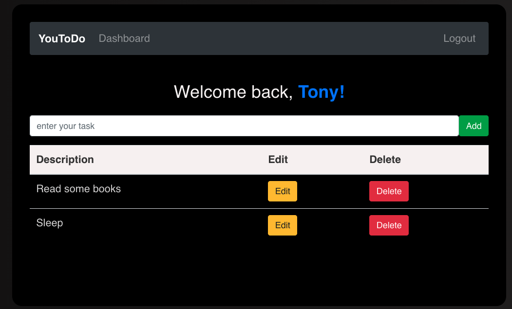

# YouToDo-PERN
The YouToDo is a web application that provide a private To-Do List for different users to manage their tasks. This web app is develop in PERN(PostgreSQL, Express, React, Node.js) Stack.

[Try it on heroku!](https://pern-deploy-0506.herokuapp.com/)
## Technologies
This project is created with:
* PostgreSQL
* Express.js
* React.js
* Node.js

Technologies involved:
* BootStrap and SCSS for styling.
* JWT(JSON web token) for authorization.
* bcrypt for authentication.
* Heroku for deployment.

## Gallary

## Directory Structure
    YouToDo
    ├── README.md
    │
    ├── client              
    │   └─── src 
    │        ├── index.js
    │        ├── App.js
    │        ├── package.json           # NPM Package file
    │        ├── styles                 # SCSS files
    │        └── components             # React components
    │           
    │
    └── server
        ├── server.js                 
        ├── db.js                       # Postgres 
        ├── database.sql                
        ├── middleware                  # Middleware
        ├── routes                      # Backend routes 
        ├── utils                       # Utilitis
        ├── .env                        # Environment variable file
        └── package.json                # NPM Package file
         
        
		